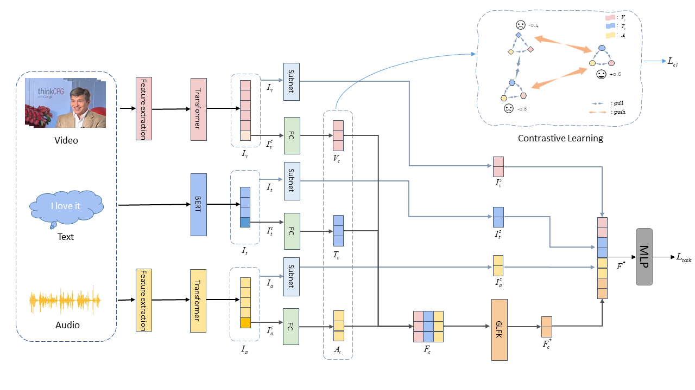

### CLGSI: Contrastive learning guided by sentiment intensity for multimodal sentiment analysis

The offical code for the paper [《CLGSI: Contrastive learning guided by sentiment intensity for multimodal sentiment analysis》]([Paper](https://aclanthology.org/2024.findings-naacl.135.pdf)).

 In this paper, we propose a novel framework for multimodal sentiment analysis based on **C**ontrastive **L**earning **G**uided by **S**entiment **I**ntensity (CLGSI). Firstly, the proposed contrastive learning guided by sentiment intensity selects positive and negative sample pairs based on the difference in sentiment intensity and assigns corresponding weights accordingly. Subsequently, we propose a new multimodal representation fusion mechanism, called **G**lobal-Local-**F**ine-Knowledge (GLFK), which extracts common features between different modalities’ representations. At the same time, each unimodal encoder output is separately processed by a Multilayer Perceptron (MLP) to extract specific features of each modality. Finally, joint learning of the common and specific features is used to predict sentiment intensity. 

### Requirements

- pytorch == 2.0.1+cu118
- transformers ==  4.32.1
- python == 3.8

### How to Run

- Download dataset from https://github.com/thuiar/MMSA
- In "config\config_regression.py" set the file path to the path where your dataset files are located.
- python run.py
- In order to facilitate the reproduction, we provide the trained weights file in [checkpoint](https://drive.google.com/drive/folders/1BsPX39uoKy18-pZMh2m4lZpR45OJuUk5?usp=drive_link) for reproducing the results.

### Acknowledge

We begin our work on the basis of [SELF-MM](https://github.com/thuiar/Self-MM) initially, so the whole code architecture is similar to it, including the data process, data loader and evaluation metrics. Thanks to their open source spirit for saving us a lot of time.
